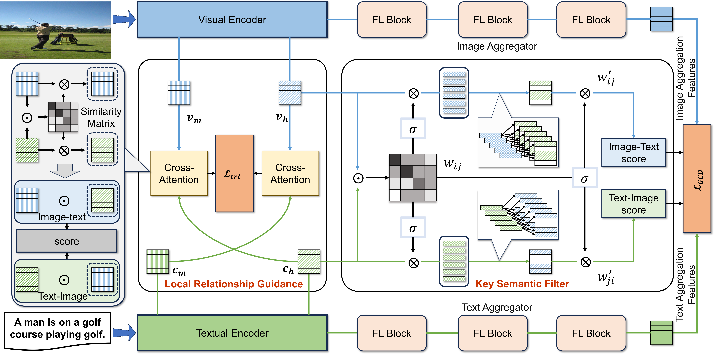

# HACAN
The codes for our paper "**HACAN: Hybrid Attention-Driven Cross-Layer Alignment Network for Image-Text Retrieval**".

## Introduction
In the field of image-text matching and cross-modal retrieval, while there have been advancements in fine-grained retrieval techniques, current methods often focus solely on the direct connections between visual elements in images and textual keywords. This focus overlooks the complex semantic interactions between modalities, at both local and global levels, leading to semantic ambiguity.



We introduce a **H**ybrid **A**ttention-Driven **C**ross-layer **A**lignment **N**etwork (**HACAN**), leveraging BERT and ConvNeXt to merge global and local strategies effectively, addressing semantic ambiguity and alignment issues. By proposing a global contrastive divergence loss, HACAN boosts the complementarity between vision and language, thereby enhancing the model's capability to distinguish between positive and negative samples. By incorporating hierarchical inference strategies, HACAN significantly improves retrieval efficiency. On the Flickr30K and MS-COCO datasets, HACAN surpasses state-of-the-art image-text retrieval methods by a margin of 5% to 8% in the Rsum metric.


## Preparation
### Dependencies
We recommended to use Anaconda for the following packages.
- python >= 3.8
- [torch](http://pytorch.org/) (>=1.8.1)
- [lightning](https://lightning.ai/) (1.8.0)
- [transformers](https://huggingface.co/docs/transformers) (4.24.0)
- torchvision
- opencv-python

### Data
The experimental dataset can be downloaded from [Flickr30K](http://shannon.cs.illinois.edu/DenotationGraph/) and [MSCOCO](http://mscoco.org/). We will subsequently release the experimental pre-trained model for public access. We refer to the path of extracted files as `$DATASET_PATH`and the storage location of the pre-trained model as `$MODEL_PATH`.

## Evaluation
Run `run.py` to evaluate the trained models on Flickr30K or MSCOCO.
```bash
Test on Flickr30K:
python run.py with data_root=`$DATASET_PATH` test_only=True checkpoint=`$MODEL_PATH`

Test on MSCOCO:
python run.py with coco_config data_root=`$DATASET_PATH` test_only=True checkpoint=`$MODEL_PATH`
```

## Training
Run `run.py` to train the model on Flickr30K or MSCOCO.
```bash
Train on Flickr30K:
python run.py with data_root=`$DATASET_PATH` loss="GCD" 

Train on MSCOCO:
python run.py with coco_config data_root=`$DATASET_PATH` loss="GCD"
```

